# Функциональные правки админки конструктора страниц

## Задача 1. H1 перенести в блок `Первый экран`

### Скриншоты

Раздел `Основное`, где сейчас находится `H1`:

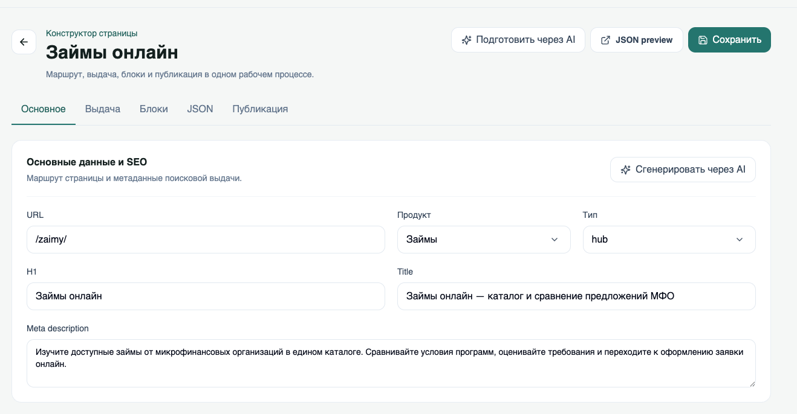

Блок `Первый экран`, где сейчас есть поле `Заголовок блока`:

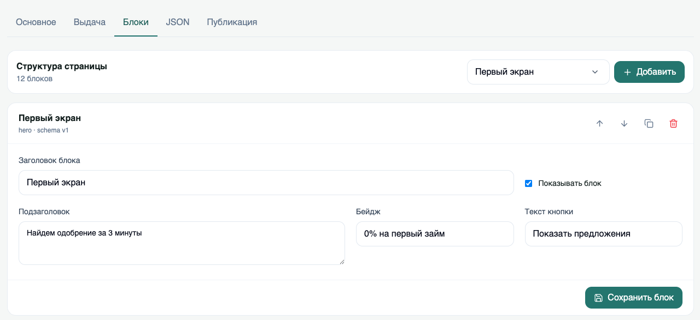

### Что не так сейчас

- В разделе `Основное` есть поле `H1`.
- В блоке `Первый экран` есть поле `Заголовок блока` со значением `Первый экран`.
- Из-за этого H1 редактируется отдельно от контента первого экрана, а поле `Заголовок блока` выглядит как лишнее служебное поле.

### Что предлагаем

- Убрать поле `H1` из раздела `Основное`.
- Перенести редактирование H1 в блок `Первый экран`.
- В блоке `Первый экран` оставить поля:
  - `H1`
  - `Подзаголовок`
  - `Бейдж`
  - `Текст кнопки`
- Поле `Заголовок блока` не должно быть `Первый экран`.

## Задача 2. Унифицировать поля и настройки блоков

### Что не так сейчас

На лендинге у блоков есть видимые поля:

- ручной `Бейдж`
- автоматический счетчик или статус
- `Заголовок`
- иногда `Подзаголовок` или описание

В админке это редактируется непоследовательно:

- у блока `Первый экран` можно редактировать `Бейдж`, `Подзаголовок` и `Текст кнопки`;
- у остальных блоков чаще всего есть только `Заголовок блока`;
- у части блоков на лендинге есть подзаголовок или описание, но в админке этого поля нет;
- из-за этого нельзя управлять текстами, которые реально видны на лендинге.

### Что предлагаем

В настройках каждого блока дать редактировать:

- видимые поля блока: `Заголовок`, `Подзаголовок` или описание, если оно отображается на лендинге у этого блока, `Бейдж`, если он задается вручную;
- контент блока: все элементы, которые отображаются внутри блока.

Автоматические счетчики не считать редактируемыми бейджами. Например, `3 предложения` в каталоге офферов зависит от количества офферов и не должен редактироваться вручную.

## Задача 3. Разделить карточку организации и офферы

### Скриншоты

| Организация: основные данные | Организация: реквизиты |
| --- | --- |
| 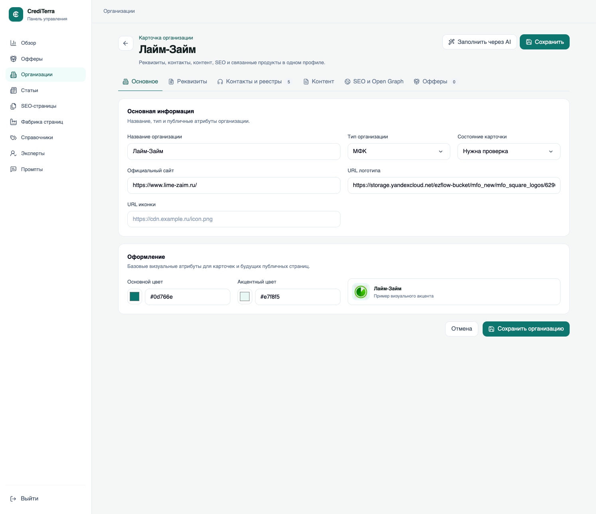 | 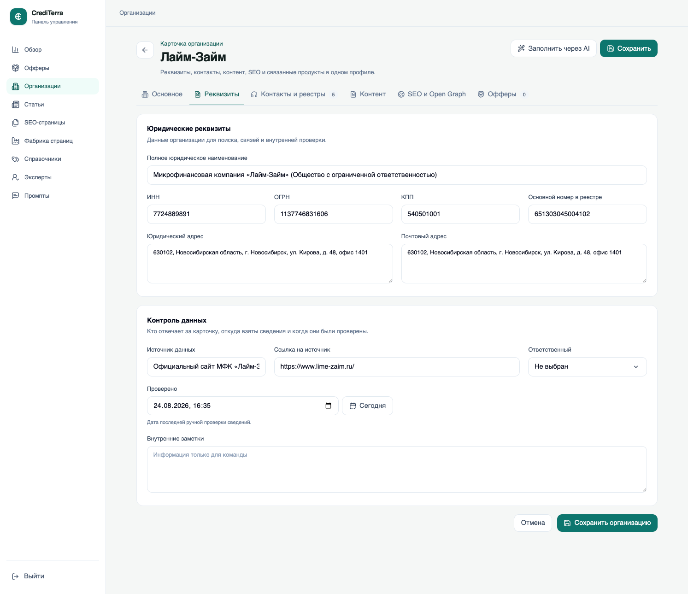 |

| Организация: контакты и реестры | Организация: контент |
| --- | --- |
| 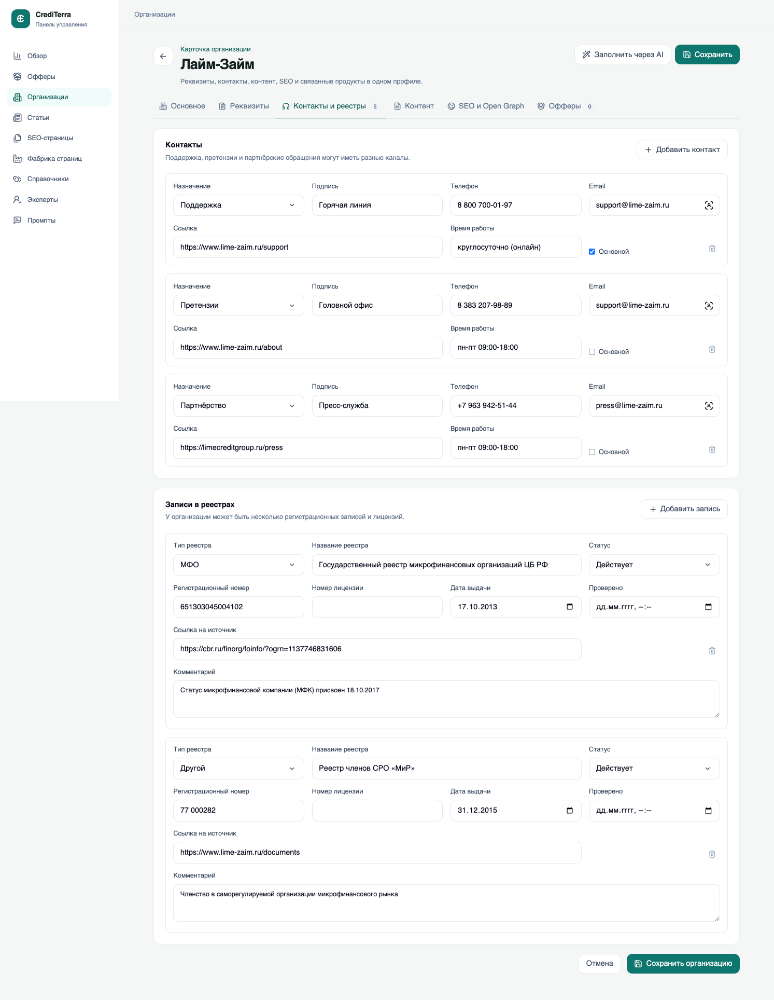 | 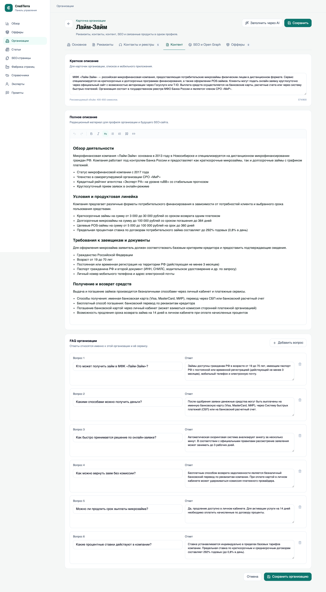 |

| Организация: SEO и Open Graph | Организация: связанные офферы |
| --- | --- |
| 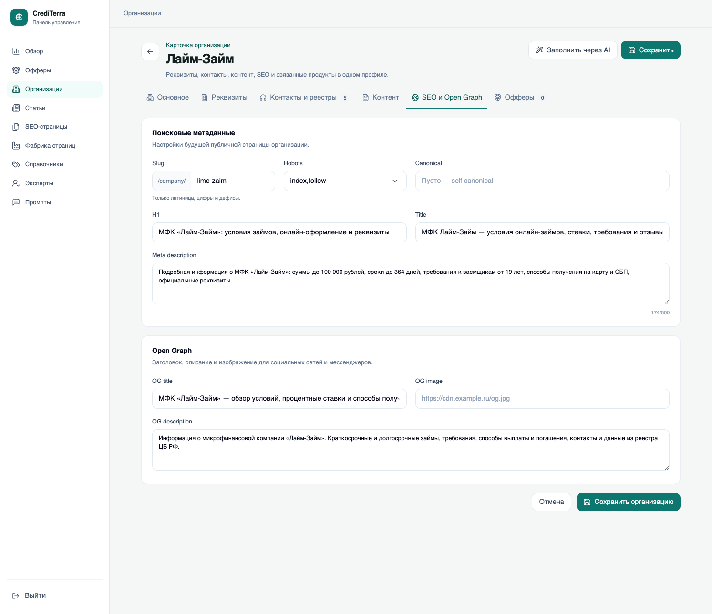 | 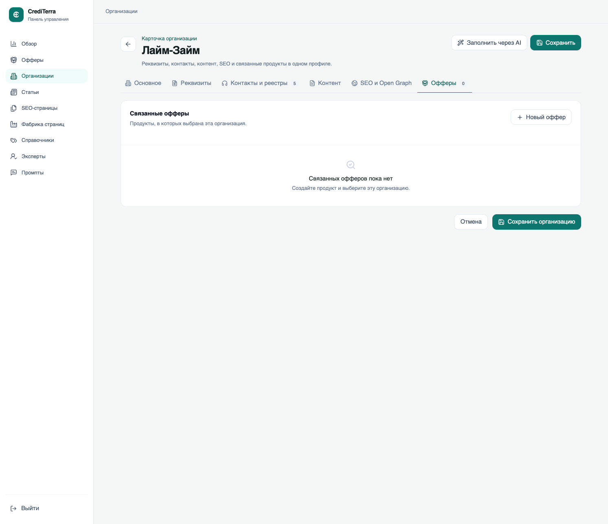 |

| Оффер: основное | Оффер: условия |
| --- | --- |
| 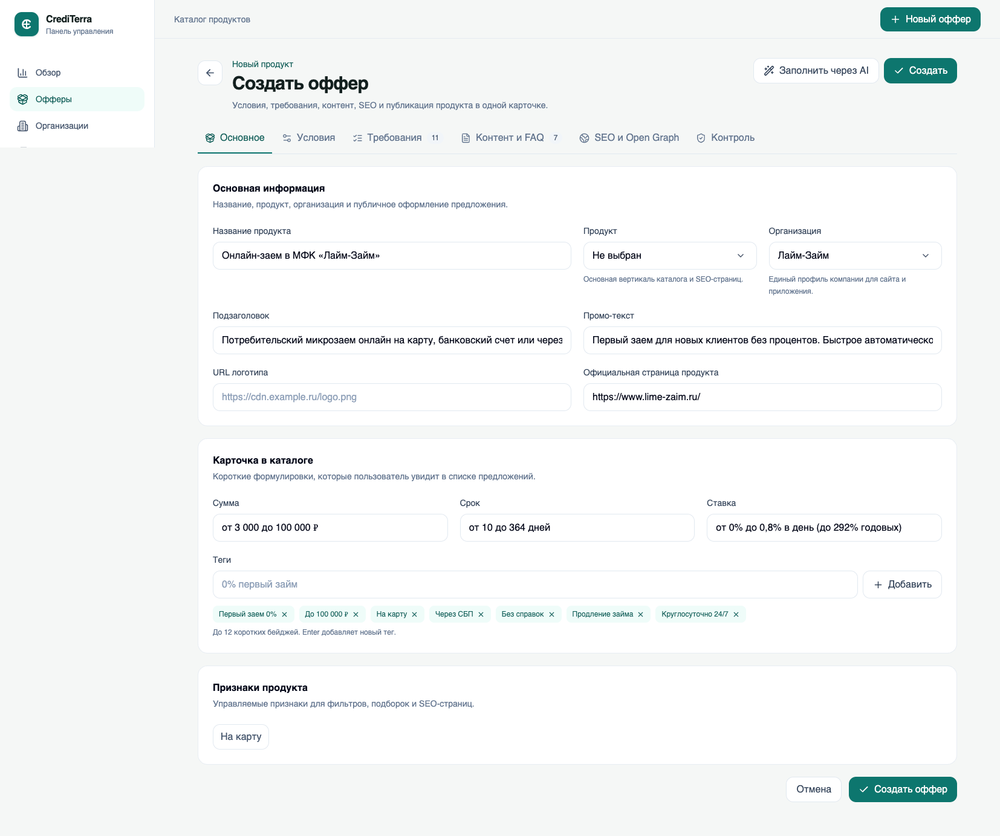 | 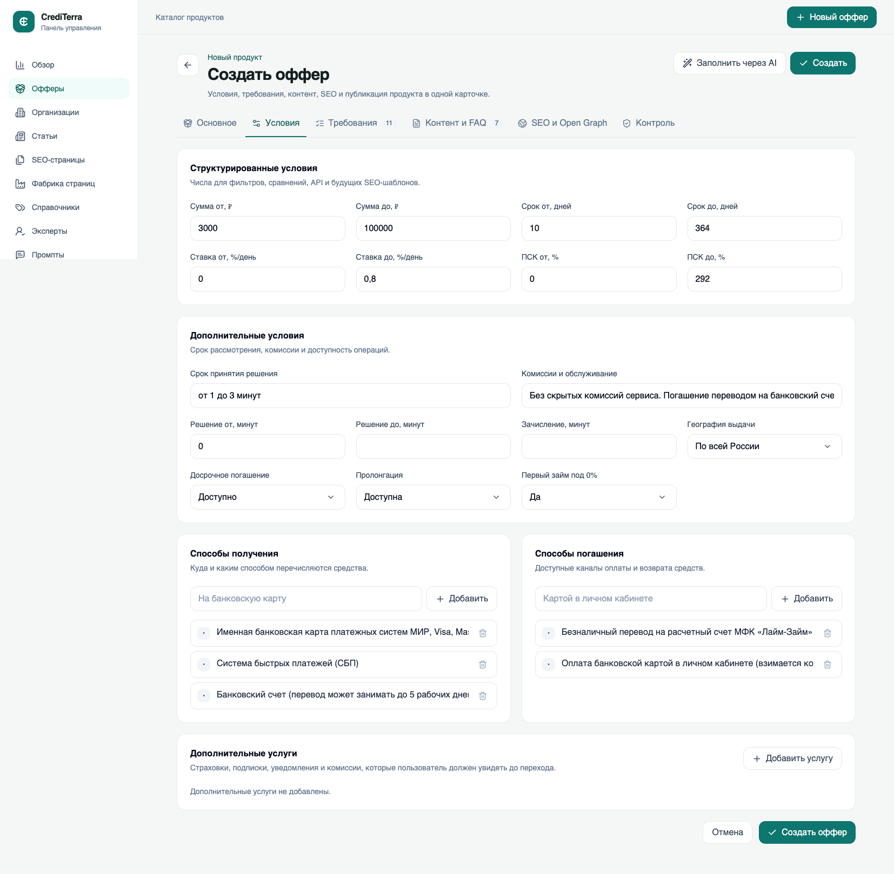 |

| Оффер: требования | Оффер: контент и FAQ |
| --- | --- |
| 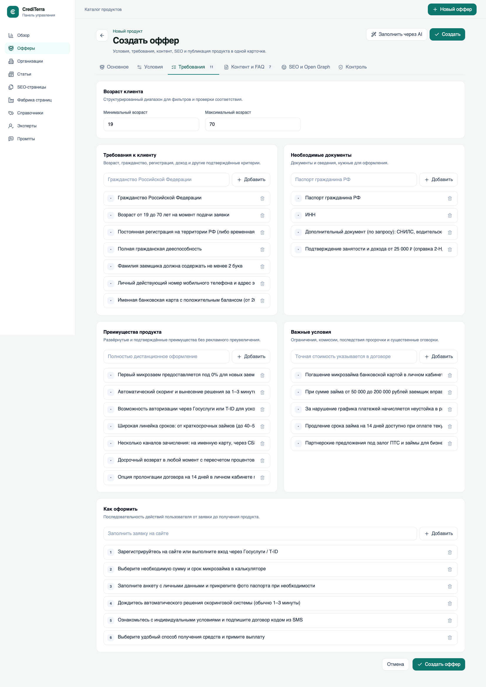 | 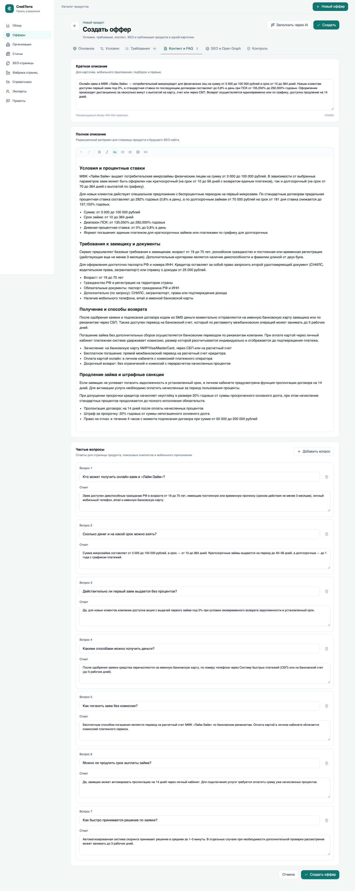 |

| Оффер: SEO и Open Graph |
| --- |
| 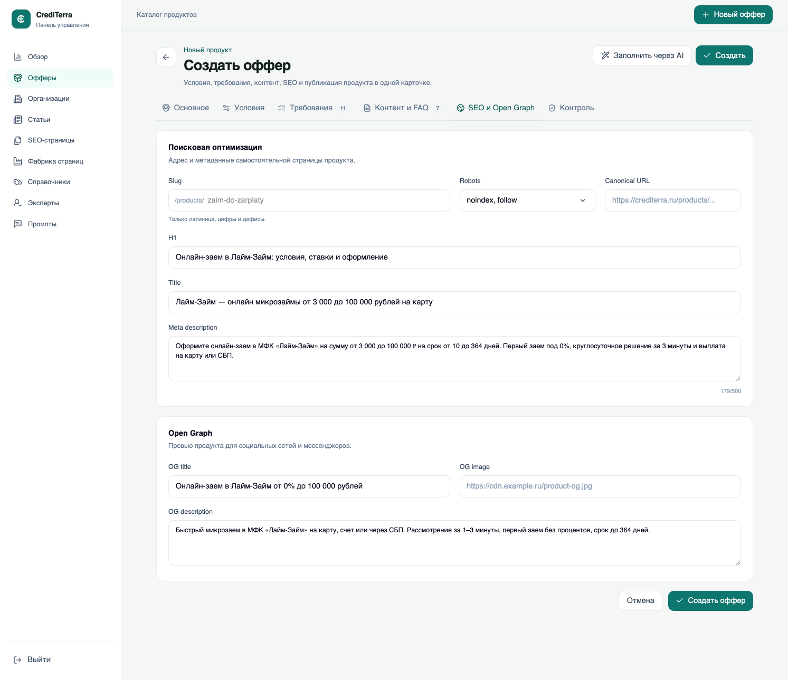 |

### Что не так сейчас

- В карточке организации уже есть данные компании: основные сведения, реквизиты, контакты, реестры, контент, SEO и вкладка `Офферы`.
- Форма создания оффера сейчас выглядит как отдельная карточка продукта со своим URL, SEO, Open Graph, H1, контентом и FAQ.
- Из-за этого при добавлении оффера приходится повторно описывать то, что уже заведено в организации.
- Оффер воспринимается как отдельная публичная страница, хотя для текущей витрины он нужен как предложение организации с условиями.

### Что предлагаем

- Оставить в карточке организации все данные компании: реквизиты, контакты, реестры, контент, SEO и публичную страницу организации.
- Во вкладке `Офферы` организации показывать список офферов этой организации.
- Создание оффера из карточки организации должно сразу связывать оффер с этой организацией.
- Оффер должен хранить название предложения и условия: сумма, срок, ставка, ПСК, первый займ под 0%, способы получения, способы погашения, требования, документы, важные условия и теги для витрин.
- Убрать из обычной формы оффера отдельный URL, H1, Title, Meta description, Open Graph, большой контент и FAQ.
- Если позже понадобится отдельная публичная страница конкретного оффера, это должно быть отдельной опцией, а не базовым сценарием создания оффера.

## Задача 4. Добавить предпросмотр публичной страницы организации

### Что не так сейчас

- В карточке организации настраиваются данные для публичной страницы организации.
- При этом в админке не видно прямой ссылки на эту публичную страницу.
- Нельзя быстро открыть страницу организации после сохранения.
- Нельзя быстро скопировать ссылку и отправить ее на проверку.

### Что предлагаем

- В карточке организации показать ссылку на публичную страницу организации.
- Добавить действия `Открыть страницу` и `Скопировать ссылку`.
- Показывать статус публичной страницы: опубликована, черновик или не создана.
- Если страница еще не опубликована, показывать понятное состояние вместо ссылки.
- Ссылку на публичную страницу можно использовать для финальной проверки содержания и отображения.
