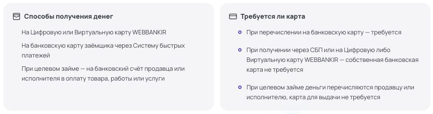
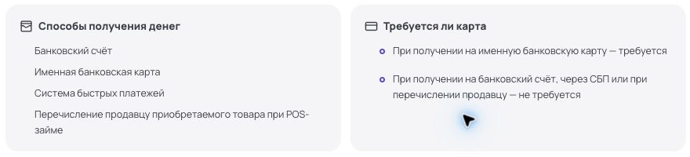
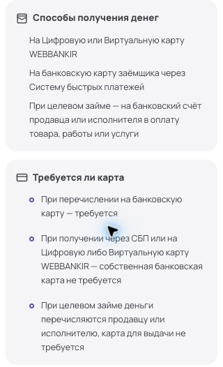
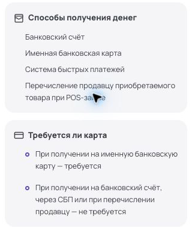

# Правки шаблона карточки МФО

## 01. Первый экран — бейджи

### ПК

<table width="100%">
<tr>
<td width="50%" align="center" valign="top">
<strong>Webbankir</strong><br>
<a href="assets/W-1920-01.png"></a>
</td>
<td width="50%" align="center" valign="top">
<strong>Лайм-Займ</strong><br>
<a href="assets/L-1920-01.png"></a>
</td>
</tr>
</table>

**Есть**

```text
[Лого] Название
       [МФК] [Действует в реестре ЦБ] [Член СРО] [Первый займ 0%: Да]
```

**Нужно**

```text
[Лого] Название
       [В реестре ЦБ] [Член СРО] [Первый заём под 0%]
```

Без акции, если выбрана другая особенность:

```text
[Лого] Название
       [В реестре ЦБ] [Член СРО] [На банковский счёт]
```

### Телефон (360 px)

<table width="100%">
<tr>
<td width="50%" align="center" valign="top">
<strong>Webbankir</strong><br>
<a href="assets/W-360-01.png"></a>
</td>
<td width="50%" align="center" valign="top">
<strong>Лайм-Займ</strong><br>
<a href="assets/L-360-01.png"></a>
</td>
</tr>
</table>

**Есть**

```text
[Лого] Название
       [МФК] [Действует в реестре ЦБ]
       [Член СРО] [Первый займ 0%: Да]
```

**Нужно**

```text
[Лого] Название
       [В реестре ЦБ] [Член СРО]
       [Первый заём под 0%]
```

Без акции, если выбрана другая особенность:

```text
[Лого] Название
       [В реестре ЦБ] [Член СРО]
       [На банковский счёт]
```

**Третий бейдж — для ПК и телефона**

- Есть акция 0% — «Первый заём под 0%». У Webbankir и «Лайм-Займ» пока оставляем его.
- Нет акции — выбираем одну полезную особенность из данных компании. Например: «Без справки о доходах» для Webbankir; «На банковский счёт» или «Оформление в офисе» для «Лайм-Займ»; «Через СБП» для обеих.
- Нет подходящей особенности — только ЦБ и СРО. На телефоне без пустой второй строки и лишнего отступа.
- Сумму и срок не дублировать; приложение, досрочное погашение и продление в третий бейдж не выносить.

Цвета: реестр — зелёный, СРО и обычная особенность — серые, акция 0% — жёлтая.

## 02. Первый экран — сумма, срок, ставка и ПСК

### ПК

<table width="100%">
<tr>
<td width="50%" align="center" valign="top">
<strong>Webbankir</strong><br>
<a href="assets/W-1920-01.png"></a>
</td>
<td width="50%" align="center" valign="top">
<strong>Лайм-Займ</strong><br>
<a href="assets/L-1920-01.png"></a>
</td>
</tr>
</table>

**Есть:** у Webbankir значения помещаются. У «Лайм-Займ» сумма обрезана: «От 3 000 до 100 000…».

**Нужно**

```text
WEBBANKIR
Сумма             Срок           Ставка в день    ПСК, годовых
1 000–50 000 ₽    7–180 дней     0–0,8%           0–292%

ЛАЙМ-ЗАЙМ
Сумма             Срок           Ставка в день    ПСК, годовых
3 000–100 000 ₽   10–364 дней    0–0,8%           29–292%
```

### Телефон (360 px)

<table width="100%">
<tr><td>
<a href="assets/financial-values-360.png"></a>
</td></tr>
</table>

**Есть:** у обеих компаний обрезаются сумма, ставка и ПСК.

**Нужно**

```text
WEBBANKIR
Сумма             Срок
1 000–50 000 ₽    7–180 дней

Ставка в день     ПСК, годовых
0–0,8%            0–292%

ЛАЙМ-ЗАЙМ
Сумма             Срок
3 000–100 000 ₽   10–364 дней

Ставка в день     ПСК, годовых
0–0,8%            29–292%
```

Формат подписей и значений одинаковый на ПК и телефоне. На ПК — четыре ячейки в ряд, на телефоне — 2×2. Размер шрифта сохранить; значения показывать полностью, без многоточий.

## 03. Убрать боковой блок «Предложение»

**Почему:** акция 0% есть не у всех компаний — для остальных пришлось бы придумывать отдельное наполнение блока. Убираем его: условия и кнопка оформления уже есть в первом экране.

### ПК

<table width="100%">
<tr>
<td width="50%" align="center" valign="top">
<strong>Webbankir</strong><br>
<a href="assets/W-1920-01.png"></a>
</td>
<td width="50%" align="center" valign="top">
<strong>Лайм-Займ</strong><br>
<a href="assets/L-1920-01.png"></a>
</td>
</tr>
</table>

**Есть:** над содержанием «На этой странице» — блок «Предложение» с заголовком про 0%, суммой, сроком и кнопкой оформления.

**Нужно:** удалить весь блок у всех компаний, независимо от наличия акции. Содержание «На этой странице» поднять на его место, без пустого отступа. Основную кнопку в первом экране сохранить.

### Телефон

**Есть:** отдельного бокового блока нет; оформление доступно в первом экране и в нижней панели.

**Нужно:** без изменений. Нижнюю панель сохранить.

## 04. Единое оформление текстовых блоков

### ПК

<table width="100%">
<tr>
<td width="50%" align="center" valign="top">
<strong>Webbankir</strong><br>
<a href="assets/W-1920-03.png"></a>
</td>
<td width="50%" align="center" valign="top">
<strong>Лайм-Займ</strong><br>
<a href="assets/L-1920-03.png"></a>
</td>
</tr>
</table>

**Есть:** перечисления оформлены по-разному: в «Способах получения денег» — просто строки без маркеров, в «Требуется ли карта» — маркированный список. Отступы тоже разные.

**Нужно:** одинаково оформить списки в обоих блоках: видимые маркеры, единый отступ и одинаковые интервалы между пунктами.

### Телефон (360 px)

<table width="100%">
<tr>
<td width="50%" align="center" valign="top">
<strong>Webbankir</strong><br>
<a href="assets/W-360-06.png"></a>
</td>
<td width="50%" align="center" valign="top">
<strong>Лайм-Займ</strong><br>
<a href="assets/L-360-06.png"></a>
</td>
</tr>
</table>

**Есть:** где-то перечисление показано просто с новой строки, где-то — маркированным списком. Разные отступы дополнительно сужают место для длинных пунктов.

**Нужно:** применить то же оформление списков. Убрать лишний отступ перед маркерами, чтобы дать тексту больше ширины.

**Как оформлять разные блоки — одинаково на ПК и телефоне**

- **Описание в первом экране, «О компании», ответы FAQ, служебные пояснения:** обычные абзацы без маркеров и отступа первой строки. Готовые перечни внутри ответа — списком.
- **Короткие факты:** подпись и значение без маркеров. Так показывать возраст, гражданство, регистрацию, географию, идентификацию, срок рассмотрения, показатели отзывов и параметры займа. Несколько разных полей не склеивать в одну строку через «·».
- **Перечни:** одинаковые маркированные списки в отзывах, условиях акции, способах оформления, документах, способах получения и погашения, требованиях к карте и заёмщику, последствиях просрочки. Один самостоятельный пункт — одна строка списка; пояснение к нему остаётся внутри пункта. Если пункт всего один, формат перечня сохраняется.
- **Условия и разные случаи:** в «Требуется ли карта», сроках перечисления и графике погашения — отдельный пункт для каждого случая. В досрочном погашении, продлении, реструктуризации, каникулах и автосписании сначала статус, если он есть; ниже — связное пояснение абзацем или несколько случаев списком. В «Формате оформления» наличие приложения — короткий факт, способы оформления — перечень.
- **Дополнительные услуги:** название, затем отдельные подписанные поля «Обязательная», «Стоимость», «Отказ». Длинный порядок отказа — обычный читаемый текст, а не мелкая сноска.
- **Данные организации, реквизиты и членство:** подписанные значения. ИНН, ОГРН и КПП — каждый со своей подписью. Название реестра, его номер, статус и дата — отдельными строками. Длинные названия и адреса — обычным начертанием, не целиком жирным.
- **Контакты и источники:** каждый телефон, email и документ — отдельная строка-ссылка без маркера списка. Группы источников сохранить. Перенос длинной ссылки выравнивать под её текстом; значок перехода — справа у первой строки. Навигацию и ссылки в подвале в маркированные списки не превращать.
- **Нет данных:** одно «Не указано» на поле, без повторного «Н/Д» под ним. Неизвестное значение не заменять на «Нет». Важные примечания с текстом оформлять абзацами или перечнем по тем же правилам.

**Отступы и переносы**

- Обычный абзац и маркер списка начинаются от одного внутреннего края карточки. Если у заголовка есть иконка — под ней; если нет — под началом заголовка.
- Продолжение пункта выравнивается под его текстом, а не под маркером. У однотипных списков одинаковые маркеры, отступы и интервалы.
- Иконку многострочного заголовка выравнивать по первой строке. Текст не обрезать; высота текстовой области растёт вместе с ним.
- Нумерация — только для действий с заданным порядком. Перечни вариантов и условий не нумеровать.
- Не превращать произвольные переносы строк, запятые и точки с запятой в новые пункты автоматически. Формат выбирать по полю и структуре данных; содержание не переписывать.

```text
[Иконка] Заголовок
Обычное пояснение.
• Длинный пункт списка,
  продолжение этого пункта.
• Следующий пункт.
```
