# Правки шаблона карточки МФО

## 01. Первый экран — бейджи

### ПК

<table width="100%">
<tr>
<td width="50%" align="center" valign="top">
<strong>Webbankir</strong><br>
<a href="assets/W-1920-01.png"></a>
</td>
<td width="50%" align="center" valign="top">
<strong>Лайм-Займ</strong><br>
<a href="assets/L-1920-01.png">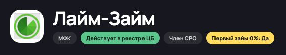</a>
</td>
</tr>
</table>

**Есть**

```text
[Лого] Название
       [МФК] [Действует в реестре ЦБ] [Член СРО] [Первый займ 0%: Да]
```

**Нужно**

```text
[Лого] Название
       [В реестре ЦБ] [Член СРО] [Первый заём под 0%]
```

Пример без акции:

```text
[Лого] Название
       [В реестре ЦБ] [Член СРО] [На банковский счёт]
```

### Телефон (360 px)

<table width="100%">
<tr>
<td width="50%" align="center" valign="top">
<strong>Webbankir</strong><br>
<a href="assets/W-360-01.png">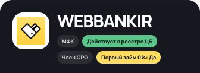</a>
</td>
<td width="50%" align="center" valign="top">
<strong>Лайм-Займ</strong><br>
<a href="assets/L-360-01.png">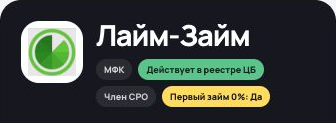</a>
</td>
</tr>
</table>

**Есть**

```text
[Лого] Название
       [МФК] [Действует в реестре ЦБ]
       [Член СРО] [Первый займ 0%: Да]
```

**Нужно**

```text
[Лого] Название
       [В реестре ЦБ] [Член СРО]
       [Первый заём под 0%]
```

Пример без акции:

```text
[Лого] Название
       [В реестре ЦБ] [Член СРО]
       [На банковский счёт]
```

**Третий бейдж — для ПК и телефона**

- Есть акция 0% — «Первый заём под 0%».
- Нет акции — один бейдж с особенностью из данных компании: например, «На банковский счёт», «Оформление в офисе», «Через СБП» или «Без справки о доходах».
- Нет подходящей особенности — только «В реестре ЦБ» и «Член СРО», без пустой второй строки и отступа под неё.
- Сумму и срок не дублировать; приложение, досрочное погашение и продление в третий бейдж не выносить.

Цвета: реестр — зелёный, СРО и обычная особенность — серые, акция 0% — жёлтая.

## 02. Первый экран — сумма, срок, ставка и ПСК

### ПК

<table width="100%">
<tr>
<td width="50%" align="center" valign="top">
<strong>Webbankir</strong><br>
<a href="assets/W-1920-01.png">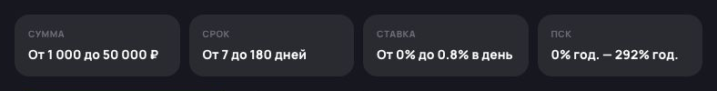</a>
</td>
<td width="50%" align="center" valign="top">
<strong>Лайм-Займ</strong><br>
<a href="assets/L-1920-01.png">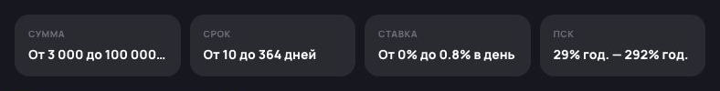</a>
</td>
</tr>
</table>

**Есть:** у Webbankir значения помещаются. У «Лайм-Займ» сумма обрезана: «От 3 000 до 100 000…».

**Нужно**

```text
WEBBANKIR
Сумма             Срок           Ставка в день    ПСК, годовых
1 000–50 000 ₽    7–180 дней     0–0,8%           0–292%

ЛАЙМ-ЗАЙМ
Сумма             Срок           Ставка в день    ПСК, годовых
3 000–100 000 ₽   10–364 дней    0–0,8%           29–292%
```

### Телефон (360 px)

<table width="100%">
<tr><td>
<a href="assets/financial-values-360.png">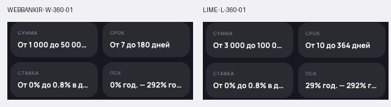</a>
</td></tr>
</table>

**Есть:** у обеих компаний обрезаются сумма, ставка и ПСК.

**Нужно**

```text
WEBBANKIR
Сумма             Срок
1 000–50 000 ₽    7–180 дней

Ставка в день     ПСК, годовых
0–0,8%            0–292%

ЛАЙМ-ЗАЙМ
Сумма             Срок
3 000–100 000 ₽   10–364 дней

Ставка в день     ПСК, годовых
0–0,8%            29–292%
```

Формат подписей и значений одинаковый на ПК и телефоне. На ПК — четыре ячейки в ряд, на телефоне — 2×2. Размер шрифта сохранить; значения показывать полностью, без многоточий.

## 03. Убрать боковой блок «Предложение»

**Почему:** акция 0% есть не у всех компаний — для остальных пришлось бы придумывать отдельное наполнение блока. Убираем его: условия и кнопка оформления уже есть в первом экране.

### ПК

<table width="100%">
<tr>
<td width="50%" align="center" valign="top">
<strong>Webbankir</strong><br>
<a href="assets/W-1920-01.png">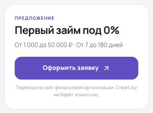</a>
</td>
<td width="50%" align="center" valign="top">
<strong>Лайм-Займ</strong><br>
<a href="assets/L-1920-01.png">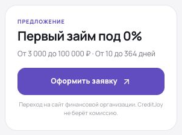</a>
</td>
</tr>
</table>

**Есть:** над содержанием «На этой странице» — блок «Предложение» с заголовком про 0%, суммой, сроком и кнопкой оформления.

**Нужно:** удалить боковой блок «Предложение» у всех компаний. Содержание «На этой странице» поднять на его место, без пустого отступа.

## 04. Отзывы — оформление пунктов

### ПК

<table width="100%">
<tr>
<td width="50%" align="center" valign="top">
<strong>Webbankir</strong><br>
<a href="assets/W-1366-02.png">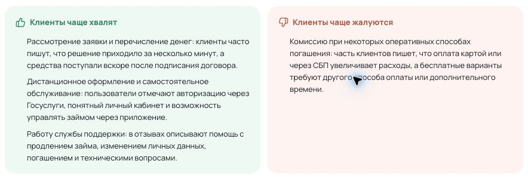</a>
</td>
<td width="50%" align="center" valign="top">
<strong>Лайм-Займ</strong><br>
<a href="assets/L-1366-02.png">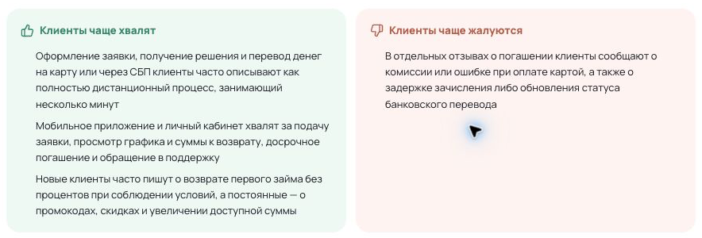</a>
</td>
</tr>
</table>

**Есть:** в «Клиенты чаще хвалят» и «Клиенты чаще жалуются» пункты идут просто с новой строки, без маркеров, но с отступом слева.

**Нужно:** добавить перед каждым пунктом маркер «•», даже если пункт один. В «Хвалят» и «Жалуются» сделать одинаковые отступы и интервалы. Маркеры — под иконкой заголовка, продолжение пункта — под его текстом.

### Телефон (360 px)

<table width="100%">
<tr>
<td width="50%" align="center" valign="top">
<strong>Webbankir</strong><br>
<a href="assets/W-360-03.png">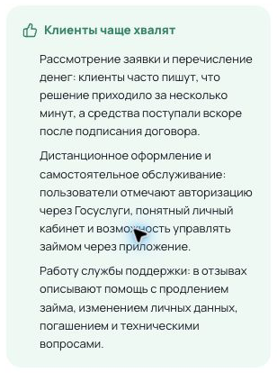</a>
</td>
<td width="50%" align="center" valign="top">
<strong>Лайм-Займ</strong><br>
<a href="assets/L-360-03.png">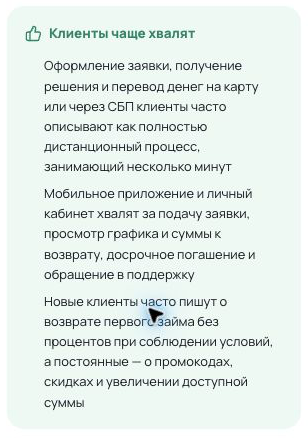</a>
</td>
</tr>
</table>

**Есть:** длинные пункты без маркеров выглядят как сплошной текст со сдвигом вправо.

**Нужно:** добавить маркеры «•» и выровнять их под иконкой заголовка. Продолжение пункта — под его текстом. Отступы и интервалы одинаковые в «Хвалят» и «Жалуются».

**Пример оформления — Webbankir**

В каждом пункте короткая тема выделена жирным, пояснение — обычным текстом.

**Клиенты чаще хвалят**

- **Рассмотрение заявки и перечисление денег:** клиенты часто пишут, что решение приходило за несколько минут, а средства поступали вскоре после подписания договора.
- **Дистанционное оформление и самостоятельное обслуживание:** пользователи отмечают авторизацию через Госуслуги, понятный личный кабинет и возможность управлять займом через приложение.
- **Работу службы поддержки:** в отзывах описывают помощь с продлением займа, изменением личных данных, погашением и техническими вопросами.

**Клиенты чаще жалуются**

- **Комиссию при некоторых оперативных способах погашения:** часть клиентов пишет, что оплата картой или через СБП увеличивает расходы, а бесплатные варианты требуют другого способа оплаты или дополнительного времени.
