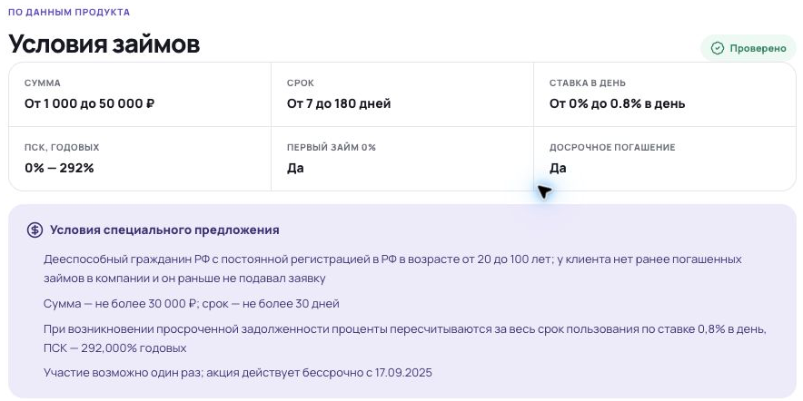
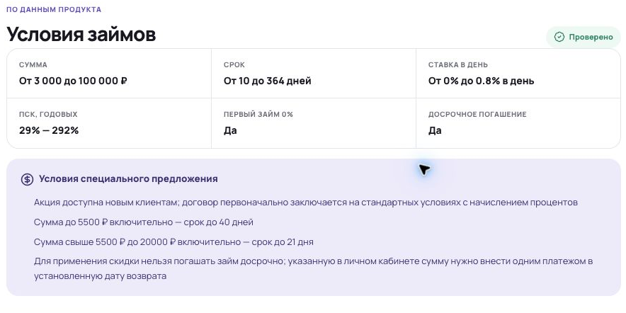
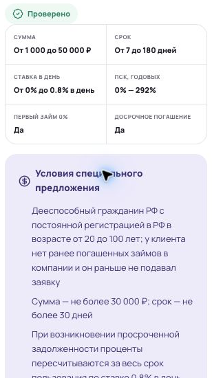
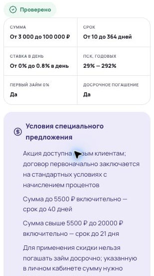

# Правки шаблона карточки МФО

## 01. Первый экран — бейджи

### ПК

<table width="100%">
<tr>
<td width="50%" align="center" valign="top">
<strong>Webbankir</strong><br>
<a href="assets/W-1920-01.png"></a>
</td>
<td width="50%" align="center" valign="top">
<strong>Лайм-Займ</strong><br>
<a href="assets/L-1920-01.png"></a>
</td>
</tr>
</table>

**Что сделать**

```text
[Лого] Название
       [В реестре ЦБ] [Член СРО] [Первый заём под 0%]
```

Пример без акции:

```text
[Лого] Название
       [В реестре ЦБ] [Член СРО] [Без справки о доходах]
```

### Телефон (360 px)

<table width="100%">
<tr>
<td width="50%" align="center" valign="top">
<strong>Webbankir</strong><br>
<a href="assets/W-360-01.png"></a>
</td>
<td width="50%" align="center" valign="top">
<strong>Лайм-Займ</strong><br>
<a href="assets/L-360-01.png"></a>
</td>
</tr>
</table>

**Что сделать**

```text
[Лого] Название
       [В реестре ЦБ] [Член СРО]
       [Первый заём под 0%]
```

Пример без акции:

```text
[Лого] Название
       [В реестре ЦБ] [Член СРО]
       [Без справки о доходах]
```

**Третий бейдж — для ПК и телефона**

Варианты:

- Первый заём под 0%
- Без справки о доходах
- Заём онлайн на карту
- Возможно продление
- Клиентам от 18 лет
- Досрочное погашение

Как выбирать:

- Есть акция 0% — «Первый заём под 0%».
- Нет акции — один из остальных вариантов, подтверждённый сурспаком компании для соответствующего займа.

Цвета:

- Реестр — зелёный.
- СРО и обычная особенность — серые.
- Акция 0% — жёлтая.

## 02. Первый экран — сумма, срок, ставка и ПСК

### ПК

<table width="100%">
<tr>
<td width="50%" align="center" valign="top">
<strong>Webbankir</strong><br>
<a href="assets/W-1920-01.png"></a>
</td>
<td width="50%" align="center" valign="top">
<strong>Лайм-Займ</strong><br>
<a href="assets/L-1920-01.png"></a>
</td>
</tr>
</table>

**Что сделать**

- Четыре ячейки в ряд.
- Единицы — в подписях, в значениях — только числа.
- Подписи — в одну строку.
- Подписи и значения показывать полностью, без многоточий.

**Пример — Webbankir**

```text
Сумма, руб        Срок, дней     Ставка, % в день     ПСК, % годовых
1 000–50 000      7–180          0–0,8                0–292
```

**Пример — Лайм-Займ**

```text
Сумма, руб        Срок, дней     Ставка, % в день     ПСК, % годовых
3 000–100 000     10–364         0–0,8                29–292
```

### Телефон (360 px)

<table width="100%">
<tr><td>
<a href="assets/financial-values-360.png"></a>
</td></tr>
</table>

**Что сделать**

- Расположить ячейки в сетке 2×2.
- Подписи и формат значений — как на ПК.
- При ширине экрана 360 px каждая подпись должна помещаться в одну строку.
- Подписи и значения показывать полностью, без многоточий.

**Пример — Webbankir**

```text
Сумма, руб           Срок, дней
1 000–50 000         7–180

Ставка, % в день     ПСК, % годовых
0–0,8                0–292
```

**Пример — Лайм-Займ**

```text
Сумма, руб           Срок, дней
3 000–100 000        10–364

Ставка, % в день     ПСК, % годовых
0–0,8                29–292
```

## 03. Убрать боковой блок «Предложение»

### ПК

<table width="100%">
<tr>
<td width="50%" align="center" valign="top">
<strong>Webbankir</strong><br>
<a href="assets/W-1920-01.png"></a>
</td>
<td width="50%" align="center" valign="top">
<strong>Лайм-Займ</strong><br>
<a href="assets/L-1920-01.png"></a>
</td>
</tr>
</table>

**Что сделать**

- Удалить боковой блок «Предложение» у всех компаний.
- Содержание «На этой странице» поднять на его место, без пустого отступа.

**Почему**

- Акция 0% есть не у всех компаний — для остальных пришлось бы придумывать отдельное наполнение блока.
- Блок есть только на ПК; ожидаемая доля ПК в трафике — до 10%.
- Условия и кнопка оформления уже есть в первом экране.

## 04. Отзывы — оформление пунктов

### ПК

<table width="100%">
<tr>
<td width="50%" align="center" valign="top">
<strong>Webbankir</strong><br>
<a href="assets/W-1366-02.png"></a>
</td>
<td width="50%" align="center" valign="top">
<strong>Лайм-Займ</strong><br>
<a href="assets/L-1366-02.png"></a>
</td>
</tr>
</table>

**Что сделать**

- Расположить блоки в две колонки: «Клиенты чаще хвалят» слева, «Клиенты чаще жалуются» справа.
- Каждый пункт оформить с маркером «•», даже если пункт всего один.
- Тему пункта выделить жирным, пояснение после двоеточия — обычным текстом.
- Маркеры выровнять по левому краю иконки заголовка.
- При переносе строки выравнивать её по началу текста пункта.
- Сделать одинаковые внутренние отступы и расстояния между пунктами в обеих колонках.

**Пример — Webbankir**

<table width="100%">
<tr>
<td width="50%" valign="top">
<strong>Клиенты чаще хвалят</strong>
<ul>
<li><p><strong>Рассмотрение заявки и перечисление денег:</strong> клиенты часто пишут, что решение приходило за несколько минут, а средства поступали вскоре после подписания договора.</p></li>
<li><p><strong>Дистанционное оформление и самостоятельное обслуживание:</strong> пользователи отмечают авторизацию через Госуслуги, понятный личный кабинет и возможность управлять займом через приложение.</p></li>
<li><p><strong>Работу службы поддержки:</strong> в отзывах описывают помощь с продлением займа, изменением личных данных, погашением и техническими вопросами.</p></li>
</ul>
</td>
<td width="50%" valign="top">
<strong>Клиенты чаще жалуются</strong>
<ul>
<li><p><strong>Комиссию при некоторых оперативных способах погашения:</strong> часть клиентов пишет, что оплата картой или через СБП увеличивает расходы, а бесплатные варианты требуют другого способа оплаты или дополнительного времени.</p></li>
</ul>
</td>
</tr>
</table>

### Телефон (360 px)

<table width="100%">
<tr>
<td width="50%" align="center" valign="top">
<strong>Webbankir</strong><br>
<a href="assets/W-360-03.png"></a>
</td>
<td width="50%" align="center" valign="top">
<strong>Лайм-Займ</strong><br>
<a href="assets/L-360-03.png"></a>
</td>
</tr>
</table>

**Что сделать**

- Расположить блоки друг под другом: сначала «Клиенты чаще хвалят», затем «Клиенты чаще жалуются».
- Маркеры, выделение темы, выравнивание строк и отступы — как на ПК.

**Пример — Webbankir**

**Клиенты чаще хвалят**

- **Рассмотрение заявки и перечисление денег:** клиенты часто пишут, что решение приходило за несколько минут, а средства поступали вскоре после подписания договора.
- **Дистанционное оформление и самостоятельное обслуживание:** пользователи отмечают авторизацию через Госуслуги, понятный личный кабинет и возможность управлять займом через приложение.
- **Работу службы поддержки:** в отзывах описывают помощь с продлением займа, изменением личных данных, погашением и техническими вопросами.

**Клиенты чаще жалуются**

- **Комиссию при некоторых оперативных способах погашения:** часть клиентов пишет, что оплата картой или через СБП увеличивает расходы, а бесплатные варианты требуют другого способа оплаты или дополнительного времени.

## 05. Условия займов — поля и оформление

### ПК

<table width="100%">
<tr>
<td width="50%" align="center" valign="top">
<strong>Webbankir</strong><br>
<a href="assets/W-1920-02.png"></a>
</td>
<td width="50%" align="center" valign="top">
<strong>Лайм-Займ</strong><br>
<a href="assets/L-1920-02.png"></a>
</td>
</tr>
</table>

**Что сделать**

- Поля оформить по общему образцу ниже. На ПК — 3 колонки × 2 строки.
- Убрать «Проверено» из блока «Условия займов».
- Условия акции оформить списком «•»: каждый существующий пункт — отдельный элемент.
- Маркеры выровнять под иконкой заголовка, продолжение пункта — под его текстом.
- Между пунктами — 8 px.

### Телефон (360 px)

<table width="100%">
<tr>
<td width="50%" align="center" valign="top">
<strong>Webbankir</strong><br>
<a href="assets/W-360-04.png"></a>
</td>
<td width="50%" align="center" valign="top">
<strong>Лайм-Займ</strong><br>
<a href="assets/L-360-04.png"></a>
</td>
</tr>
</table>

**Что сделать**

- Поля оформить по общему образцу ниже. На телефоне — 2 колонки × 3 строки.
- Убрать «Проверено» вместе с пустой строкой под него.
- Условия акции — списком «•» с теми же отступами, что на ПК.
- Иконку заголовка выровнять по первой строке текста.

**Формат полей — для ПК и телефона**

- Подписи и формат значений — как в первом экране ([пункт 2](#02-первый-экран--сумма-срок-ставка-и-пск)): подпись сверху, значение снизу.
- У суммы, срока, ставки и ПСК единицы измерения — в подписях, в значениях — только числа.
- Все подписи должны помещаться в одну строку на ПК и телефоне от 360 px.
- Подписи и значения показывать полностью, без многоточий.

**Пример — Webbankir**

- **Сумма, руб:** 1 000–50 000
- **Срок, дней:** 7–180
- **Ставка, % в день:** 0–0,8
- **ПСК, % годовых:** 0–292
- **Первый заём под 0%:** Да
- **Досрочное погашение:** Да

Это подписи и значения шести ячеек; порядок — слева направо, сверху вниз. Для «Лайм-Займ» — тот же формат со значениями компании.
