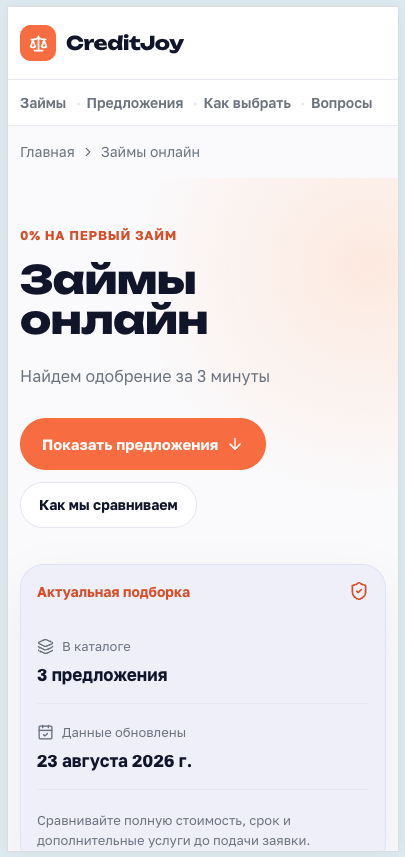
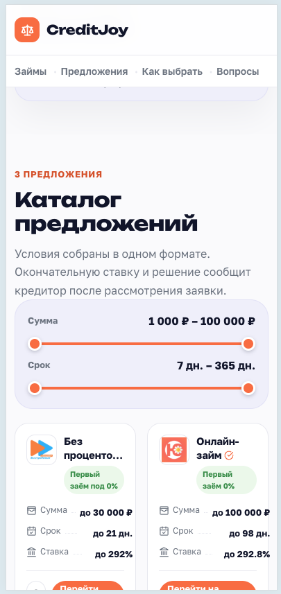
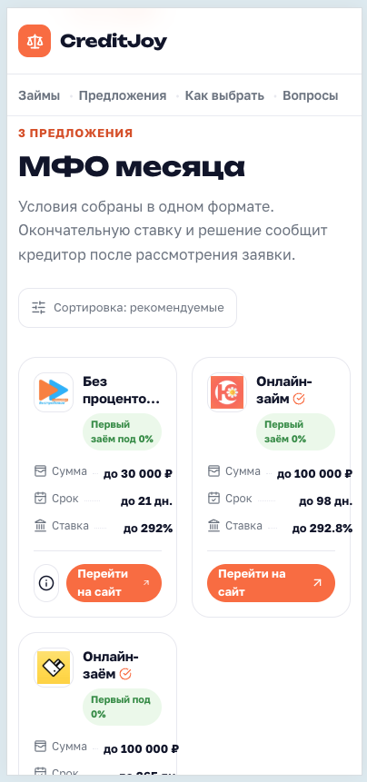
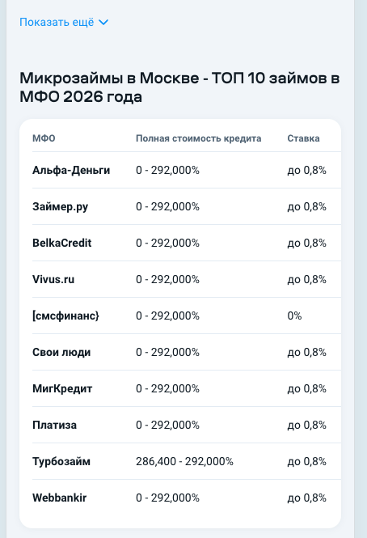

# Дизайн-правки лендинга

В этот файл складываем правки по визуалу, верстке и отображению блоков на лендинге.

## Задача 1. Поднять выбор суммы и срока в первый экран

### Скриншоты

| Текущий первый экран на мобиле | Текущий переход к каталогу на мобиле |
| --- | --- |
|  |  |

### Что не так сейчас

- На первом экране есть две кнопки: `Показать предложения` и `Как мы сравниваем`.
- Карточка `Актуальная подборка` занимает много места.
- Выбор суммы и срока появляется только ниже, уже в блоке каталога.
- Из-за этого первый экран выглядит перегруженным, а главный сценарий подбора начинается слишком поздно.

### Что предлагаем

Упростить первый экран:

```text
0% на первый займ
Займы онлайн
Найдем одобрение за 3 минуты

[Сумма] 1 000 ₽ — 100 000 ₽
[Срок] 7 дн. — 365 дн.

ХХ предложения(й) · обновлено ХХ месяц 202х г.
```

- Убрать кнопки `Показать предложения` и `Как мы сравниваем`.
- Убрать отдельную карточку `Актуальная подборка`.
- Поднять выбор суммы и срока в первый экран.
- Количество предложений и дату обновления показывать компактной строкой под выбором суммы и срока.
- Каталог предложений показывать сразу ниже первого экрана.

## Задача 2. Переделать `МФО месяца` в таблицу

### Скриншоты

| Сейчас: карточки как в каталоге | Ориентир: сравнительная таблица |
| --- | --- |
|  |  |

### Что не так сейчас

- Блок `МФО месяца` выглядит почти так же, как `Каталог предложений`.
- Из-за повторения карточек блок не дает нового формата сравнения.
- На лендинге подряд идут два похожих блока с офферами.

### Что предлагаем

- Оставить карточки офферов для блока `Каталог предложений`.
- Блок `МФО месяца` сделать как сравнительную таблицу.
- В таблице показать МФО и ключевые параметры для быстрого сравнения: сумма, срок, ставка или ПСК, первый займ под 0%.
- На мобиле таблица тоже должна читаться как сравнение, а не повтор карточек каталога.
